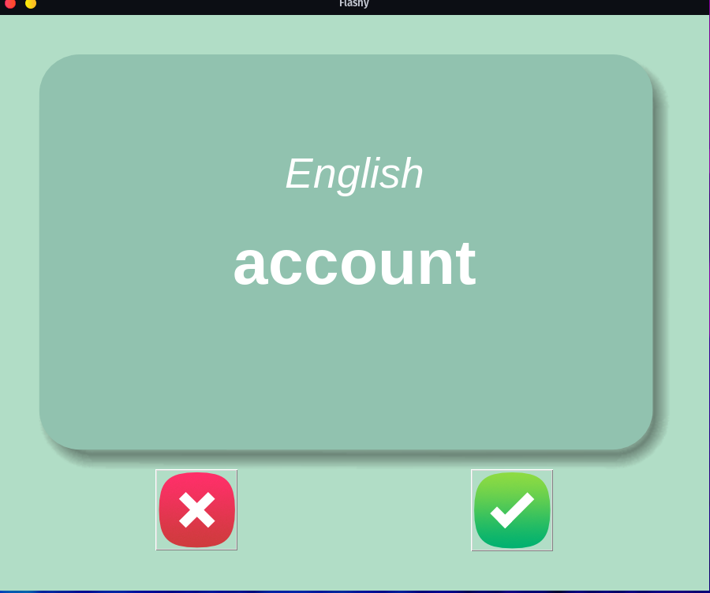

# Flashy - Language Learning App

Flashy is a simple language learning app using Tkinter in Python. It helps users learn new French words by displaying
flashcards that show the French word and its English translation. Users can choose to remove words from the list if they
feel confident they've learned them.


## Features

- Displays French words on flashcards
- Flips cards to show English translations after 3 seconds
- Allows users to remove learned words from the list
- Saves progress by storing words to learn in a separate CSV file

## Installation

1. Clone the repository or download the code as a ZIP file.

```sh
git clone https://github.com/j-breedlove/flashy.git
```

2. Navigate to the project directory.

```sh
cd flashy
```

3. Install the required dependencies, `pandas` and `tkinter`.

```sh
pip install pandas
```

1. Run the `main.py` file to start the application.

```sh
python main.py
```

## Usage

1. When the application starts, a flashcard will appear showing a French word.
2. After 3 seconds, the card will flip, revealing the English translation.
3. If you feel confident that you've learned the word, click the "wrong" button (red cross) to remove the word from the
   list.
4. Click the "right" button (green checkmark) to move on to the next word without removing it from the list.
5. The application saves your progress in a `words_to_learn.csv` file, and the next time you run the app, it will only
   show words you still need to learn.

## Contributing

Pull requests are welcome. For major changes, please open an issue first to discuss what you would like to change.

## License

[MIT License](https://choosealicense.com/licenses/mit/)